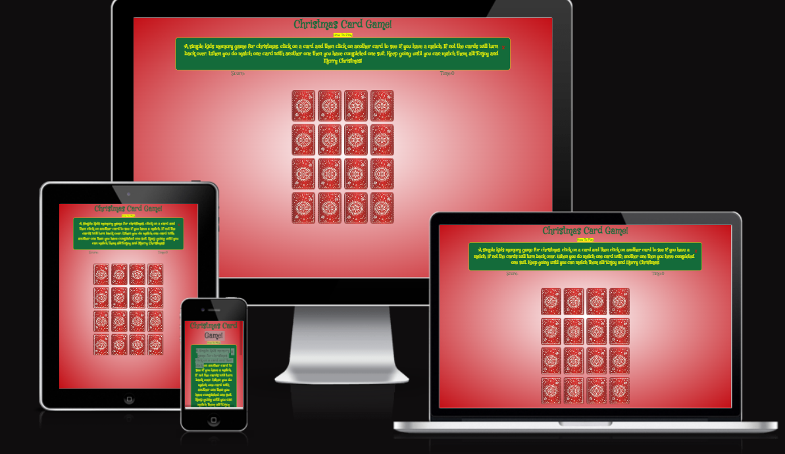
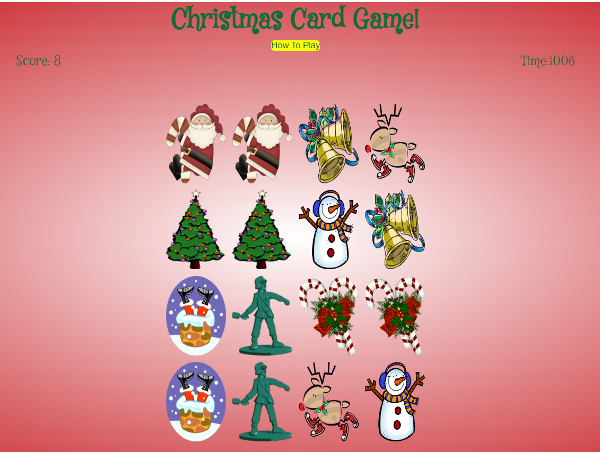
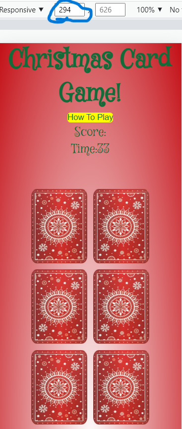
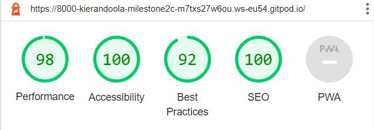
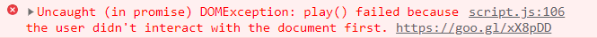

<h1 align="center"> The Christmas Game</h1>

[View the live project here.]()

This is the main website for the site called The Christmas Game. It is designed to be responsive and accessible on a range of devices, making it easy to navigate for potential clients and visitors of the page.

<h2 align="center"></h2>

## User Experience (UX)

-   ### User stories

    -   #### First Time Visitor Goals

        1. As a First Time Visitor, I want to easily understand the main purpose of the site and learn more about how the game works.
        2. As a First Time Visitor, I want to be able to easily navigate throughout the site to find content.
         

    -   #### Returning Visitor Goals

        1. As a Returning Visitor, I want to play the game when i have free time.
        2. As a Returning Visitor, I want my kids to play the game to help with their memory exercises.
        3. As a Returning Visitor, I want to see can i improve my time in completing the game and see can my friends beat me time.
    

-   ### Design
    -   #### Colour Scheme
        -   The three main colours used are red, white and green as its a christmas themed website.
    -   #### Typography
        -   I used google font to select my fonts. They are 'Mystery Quest' and cursive'. Both are attractive for the website.
    -   #### Imagery
        -   Imagery is important. I used eight different images to be christmas themed designed for younger users. 

*   ### Wireframes (Do)

    -   All wireframes are located here [here](readme/wireframe-project.bmpr).
    -   I have added timetables into the actual website which is not on the wireframes.
    -   Tablet wireframes were not added as it is the same as desktop viewing.

## Features

-   Responsive on all device sizes

## Screenshots 

- The Website is very straightforward. This is the desktop view of the website with the cards turned around to see all the matching pairs.

<h2 align="center"></h2>

- This is a screen less than 300px and you can see media query has been shown to make to rows of cards for the user experience.

<h2 align="center"></h2>

### Languages Used

-   [HTML5](https://en.wikipedia.org/wiki/HTML5)
-   [CSS3](https://en.wikipedia.org/wiki/Cascading_Style_Sheets)
-   [Javascript](https://en.wikipedia.org/wiki/JavaScript)

### Frameworks, Libraries & Programs Used

1. [Google Fonts:](https://fonts.google.com/)
    - Google fonts were used to import the Mystery Quest' and cursive' font into the style.css file which is used on all pages throughout the project.
1. [Git](https://git-scm.com/)
    - Git was used for version control by utilizing the Gitpod terminal to commit to Git and Push to GitHub.
1. [GitHub:](https://github.com/)
    - GitHub is used to store the projects code after being pushed from Git.
1. [Balsamiq:](https://balsamiq.com/)
    - Balsamiq was used to create the wireframes during the design process.

## Testing (Do)

The W3C Markup Validator and W3C CSS Validator Services were used to validate every page of the project to ensure there were no syntax errors in the project.

-   [W3C Markup Validator](https://validator.w3.org/) - [Results](https://validator.w3.org/nu/?doc=https%3A%2F%2F8000-kierandoola-milestone2c-gv1kzjq4odu.ws-eu54.gitpod.io%2F)
-   [W3C CSS Validator](https://jigsaw.w3.org/css-validator/#validate_by_input) - [Results](https://jigsaw.w3.org/css-validator/validator?uri=https%3A%2F%2F8000-kierandoola-milestone2c-gv1kzjq4odu.ws-eu54.gitpod.io%2F&profile=css3svg&usermedium=all&warning=1&vextwarning=&lang=en#css)

### Testing User Stories from User Experience (UX) Section

-   #### First Time Visitor Goals

    1. As a First Time Visitor, I want to easily understand the main purpose of the site and learn more about the Game.

        1. Upon entering the site, I found it was just a simple memory game that was christmas themed.
        2. I can see there is Rules on how to play the game, Very easy to understand
        

    2. As a First Time Visitor, I want to be able to easily be able to navigate throughout the site to find content.

        1. The site pages are small and easy to read. Straight to the point and the user should find all of the information.
        2. The page cards are interactive and Fun. Great for Kid users who would like to enjoy using the website
        

### Further Testing 

-   The Website was tested on Google Chrome, Microsoft Edge and Safari browsers.
-   The website was viewed on a variety of devices such as Desktop, Laptop and developer tools app which provides mock up phones  with responsive.
-   I have tested the webpage with Lighthouse and have maintained a high standard throughout for Performance, Accessibilty,
    Best Pratice and SEO. 

     <h3 align="center"></h3>

### Fixed Bugs

-   I tried to put in a Christmas Song in the Background but due to autoplay policies tightening up this isn't possible. I was going to put in a click to play but i thought the song was quite annoying and would give the user a bad experience.
 <h2 align="center"></h2>

-   When a user would click the card it would start the time but if they clicked another card it would increase the time faster. It has now been resovled.

-  When a user would match two cards it would score 1. but when they matched another two cards would stay at 1. This has also been resovled.

## Deployment

### GitHub Pages

The project was deployed to GitHub Pages using the following steps...

1. Log in to GitHub and locate the [GitHub Repository](https://github.com/)
2. At the top of the Repository (not top of page), locate the "Settings" Button on the menu.
3. Scroll down the Settings page until you locate the "GitHub Pages" Section.
4. Under "Source", click the dropdown called "None" and select "Master Branch".
5. The page will automatically refresh.
6. Scroll back down through the page to locate the now published site [link](https://github.com) in the "GitHub Pages" section.

## Credits

### Code
-  I had alot of difficult understanding Javascript and i still do. I'm hoping to keep praticing
    and to learn alot more throughout the course and outside the course. I relied alot in the 
    understanding of it through serveral Youtube Videos and Websites such as [W3schools](https://www.w3schools.com/howto/howto_css_modals.asp) AND [Stack Overflow](https://stackoverflow.com/). The YouTube Videos Included:

    -  [Code with Ania Kubów](https://youtu.be/tjyDOHzKN0w)
    -  [PortEXE](https://youtu.be/3uuQ3g92oPQ)
    -  [freeCodeCamp.org](https://youtu.be/ZniVgo8U7ek)
    -  [Dev ED](https://youtu.be/-tlb4tv4mC4)
    

### Acknowledgements

-   My Mentor for continuous helpful feedback.

-   Tutor support at Code Institute for their support.

-   The Teachers at Code Institude for helpful videos and walk through project

-   My collegues on the slack app who helped me when i had any issues.